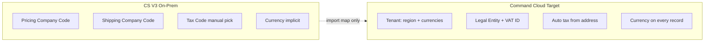
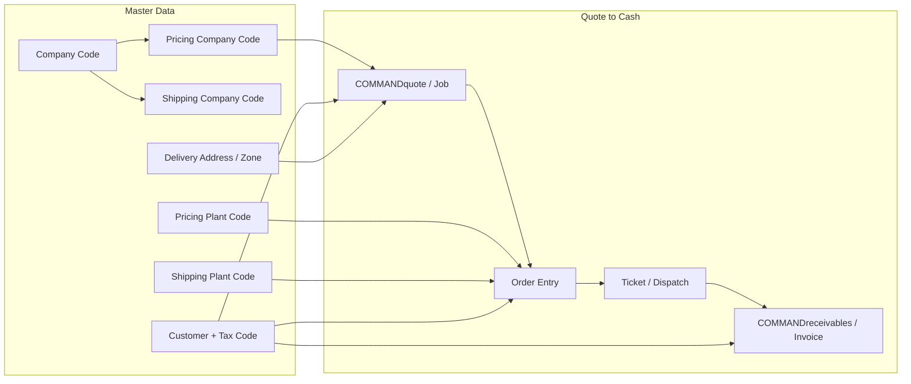
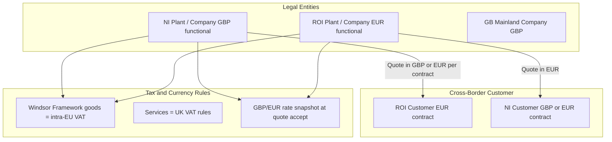
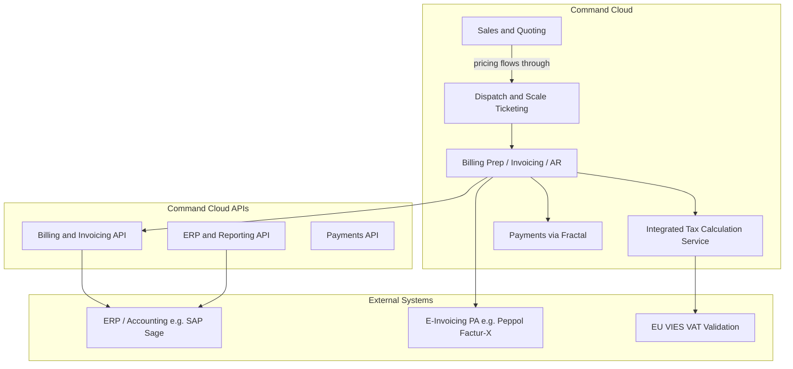
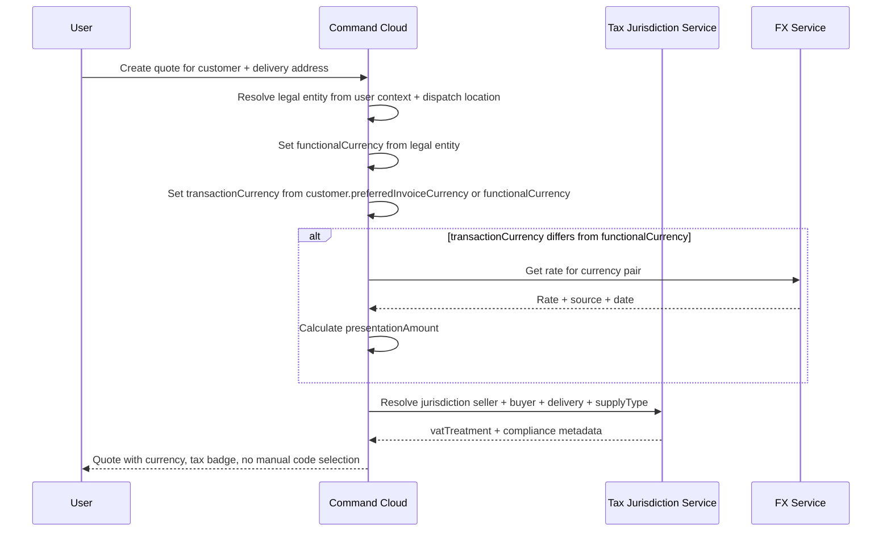

# Cross-Border Transactions: CS V3 Evaluation & Cloud-First Scoping Plan

## Strategic intent

Command Cloud should **not replicate** the CS V3 on-prem cross-border model. CS V3 spreads currency, tax, and pricing concerns across implicit configuration (company codes, plant codes, tax codes, accounting categories) with no first-class currency model — workable for single-currency deployments but **disjointed and admin-heavy** for international operations.

**Design goals for Command Cloud:**

1. **Simplify setup** — admins configure a small number of tenant-level settings; the platform infers tax jurisdiction and currency defaults from delivery address, legal entity, and customer contract
2. **Multi-currency from MVP** — currency fields are mandatory in the data model from day one, even when transaction and functional currency are the same (EUR/EUR)
3. **Progressive enhancement** — MVP foundation → corridor compliance rules → multi-entity → advanced FX/treasury
4. **Do not carry forward CS V3 UX** — no "Pricing Company Code" / "Shipping Company Code" exposed to users; map these to cloud-native **Legal Entity** and **Location** models internally



## Investigation Summary (Current Evidence)

### What we could and could not verify

| Source | Status |
|--------|--------|
| CS V3 application source code | **Not in workspace** — [`/workspace`](README.md) contains only a README |
| Internal Confluence/Jira | **Not accessible** — Atlassian MCP requires authentication |
| Prototype docs on remote branches | Available — EU regional-gating pattern in [docs/command-series-v3-hauler-license-expiry.md](https://github.com/cprouse1975/cursor_prototypes_local/blob/cursor/hauler-expiry-rules-e605/docs/command-series-v3-hauler-license-expiry.md) |
| Public Command Alkon product docs | Available — Sales & Quoting, Dispatch, Billing, APIs, Payments |
| Legacy CS user guides (COMMANDexecutive, customer training PDFs) | Available — pricing/tax hierarchy, no explicit currency fields |

**Important nuance for your France → Germany example:** both countries use **EUR**. Cross-border complexity here is primarily **tax jurisdiction, VAT treatment, legal entity, and e-invoicing** — not FX conversion. Currency display will typically show **€** throughout; the meaningful differences are tax codes, company/plant routing, and invoice compliance metadata.

**Northern Ireland / UK ↔ Republic of Ireland is a different class of problem:** this corridor involves **two currencies (GBP and EUR)**, **post-Brexit dual VAT rules** under the Windsor Framework, and an **XI-prefixed VAT identifier** for NI businesses trading goods with the EU. For International RMC customers operating border plants (common on the island of Ireland), this is likely the **highest-priority cross-border scenario** — and the one where multi-currency and FX support matter most.

### Reference corridor comparison

| Dimension | France → Germany | NI/UK ↔ Republic of Ireland |
|-----------|------------------|----------------------------|
| Currencies | EUR only | **GBP (£) and EUR (€)** |
| Primary complexity | Intra-EU VAT, e-invoicing | **FX conversion + dual VAT regime + post-Brexit rules** |
| VAT on goods (B2B) | Intra-EU reverse charge / zero-rated | NI↔ROI treated as **intra-EU for goods** (Windsor Framework); GB↔ROI is export/import |
| VAT on services | EU reverse charge | **UK VAT rules** apply (not EU goods rules) |
| VAT ID format | FR… / DE… | **XI…** prefix for NI; IE… for ROI |
| E-invoicing timeline | FR Sep 2026; DE already active | **ROI Nov 2028** (phased); **UK Apr 2029** (mandatory) |
| Command Alkon precedent | General EU regional gating | **Hauler spec already Ireland-specific** (`Europe/Dublin`, EU waste carrier license) |
| FX required? | No | **Yes** — unless customer always prices/invoices in one currency |

---

## CS V3 evaluation — what to improve, not replicate

### Why the CS V3 approach is unsuited to cloud international operations

| CS V3 pattern | Problem | Cloud replacement |
|---------------|---------|-------------------|
| Currency **implicit** per company code | No explicit currency on quotes/orders; cross-currency requires duplicate price lists or manual spreadsheet conversion | **`transactionCurrency` on every monetary record** from MVP |
| **Pricing Company Code** vs **Shipping Company Code** vs **Shipping Plant Code** | Three overlapping codes admins must understand and maintain; error-prone at border plants | Single **Legal Entity** + **Location** model; system resolves pricing/dispatch entity from context |
| **Tax Code** manually linked to customer | Admin must pre-configure every cross-border tax scenario; no address-driven resolution | **Auto tax jurisdiction** from seller entity + buyer country + delivery address + supply type |
| Separate modules (COMMANDquote, order entry, COMMANDreceivables) | Pricing/tax/currency context may not propagate cleanly | Unified quote-to-cash pipeline with **locked monetary context** at each stage transition |
| Per-site database / Citrix deployment | Configuration duplicated per install; no central tenant policy | **Tenant-level policy**: enabled currencies, FX source, default locale, regional compliance flags |
| ERP owns FX | Cloud has no rate snapshot; audit trail breaks between quote and invoice | **Platform FX snapshot** at quote acceptance; ERP receives immutable rate metadata |
| No presentation currency | NI salesperson cannot show EUR equivalent to ROI customer without manual calc | **`presentationCurrency`** optional field, auto-calculated from tenant FX feed |

### What to preserve from CS V3 (via import, not UX)

- Historical monetary amounts and tax codes exactly as stored (import fidelity per hauler spec)
- Company/plant/customer hierarchy **as import source fields**, mapped to Cloud canonical model
- Existing customer contracts that specify invoice currency

### What CS V3 discovery must answer (Phase 0)

- Which CS V3 configurations are **workarounds** for missing multi-currency (dual price lists, manual FX) vs intentional business rules
- How much admin time is spent maintaining tax codes and company code permutations at border sites
- Which fields can be ** dropped from Cloud UI** entirely and resolved automatically

---

CS V3 does not expose a first-class "multi-currency" module in available documentation. Instead, monetary values flow through a **company/plant/customer hierarchy** with **tax codes** determining jurisdiction.



### Currency determination (inferred)

| Stage | Likely rule | User display |
|-------|-------------|--------------|
| **Quote** | Prices resolved from **Pricing Company Code** + **Pricing Plant Code** + customer/job pricing tables. Currency is implicit — tied to the **pricing company's legal entity / accounting setup**, not the customer's country. | Amounts shown in the company's configured currency (EUR for EU deployments). No currency selector on quote screens in available docs. |
| **Order** | Inherits quote/project pricing. **Shipping Plant Code** may differ from **Pricing Plant Code** (common for border plants). **Tax Code** on customer/order drives VAT. | Same currency as pricing company. Tax code description visible via smart lookup. |
| **Invoice** | Posted from tickets/orders. Amount + tax breakdown. Cross-border B2B typically **net + zero VAT** (reverse charge / intracommunity supply) when both parties have valid EU VAT IDs — configured via tax codes, not currency conversion. | Invoice PDF/screen shows line amounts, tax code, net/gross per local accounting rules. |

### Key CS V3 configuration fields (from COMMANDexecutive user guide)

These fields appear on order/quote configuration and drive cross-border behaviour more than currency:

- **Pricing Company Code** — which legal entity's price list applies
- **Shipping Company Code** — which entity dispatches / owns the delivery
- **Pricing Plant Code** / **Shipping Plant Code** — plant-level pricing vs dispatch origin (relevant for a French plant serving a German site near the border)
- **Tax Code** — customer-linked; determines VAT treatment
- **Delivery Address / Zone Code** — delivery location for tax and freight
- **Accounting Category Code** — GL mapping downstream to ERP

### France → Germany concrete scenario (EUR, cross-border)

For a French producer billing a German customer at a border plant:

1. **Quoting:** Sales creates quote under French **Pricing Company** price tables (EUR). Delivery address in Germany sets zone/freight; tax code reflects B2B cross-border rules.
2. **Orders:** **Shipping Plant** may be the French border plant; **Pricing Plant** may match or differ. Order inherits EUR amounts from quote.
3. **Invoicing:** Invoice issued in EUR from the French legal entity. VAT likely **0% with reverse charge** (both VAT-registered) or destination rules depending on goods vs services and movement — handled by **Tax Code**, not currency logic.
4. **Display:** Users see EUR amounts everywhere. Cross-border distinction is visible via customer country, delivery address, tax code description, and invoice legal text — not a currency switcher.

### Northern Ireland / UK ↔ Republic of Ireland scenario (GBP/EUR, post-Brexit)

This corridor is especially relevant for International RMC: border plants near Derry/Londonderry, Newry, and Donegal routinely serve customers on both sides. The existing [hauler license spec](https://github.com/cprouse1975/cursor_prototypes_local/blob/cursor/hauler-expiry-rules-e605/docs/command-series-v3-hauler-license-expiry.md) already targets **Ireland** (`Europe/Dublin` timezone, EU waste carrier compliance) — cross-border monetary support should extend the same regional pattern.



#### Direction A: NI producer → ROI customer (most common RMC pattern)

Example: Ready-mix plant in County Derry dispatching to a construction site in Donegal.

| Stage | Currency | Tax / compliance |
|-------|----------|------------------|
| **Quote** | Typically **GBP** (NI company's functional currency) unless customer contract specifies EUR. If EUR requested, show **both** or convert with displayed FX rate. | Delivery address in ROI triggers **intra-EU goods** treatment. Customer **IE VAT number** required. Seller uses **XI-prefixed VAT number** on all EU-facing documentation. |
| **Order** | Locked to quote currency. **Shipping Plant** = NI border plant; **Pricing Company** = NI legal entity. | **Tax Code** reflects zero-rated B2B intra-EU supply of goods. Proof of movement may be required for audit. |
| **Ticket / Dispatch** | Amounts in transaction currency. Hauler EU license check applies (`isEuRegion = true`, `Europe/Dublin`). | Dispatch date evaluated in **Europe/Dublin** local calendar (per hauler spec). |
| **Invoice** | Invoice in **quote currency** (GBP or EUR). If ERP functional currency differs, export **both amounts + FX rate snapshot**. | Zero VAT on invoice; **EC Sales List** (ROI side) / **intra-EU acquisition** reporting. Invoice must show XI VAT number and customer IE VAT number. |

#### Direction B: ROI producer → NI customer

Example: Aggregate supplier in Monaghan delivering to a site in Armagh.

| Stage | Currency | Tax / compliance |
|-------|----------|------------------|
| **Quote** | **EUR** (ROI functional currency). NI customer may request GBP equivalent for their internal budgeting — display as secondary, not as legal quote currency unless contract dictates. | ROI seller charges **no Irish VAT** on B2B goods to NI (intra-EU supply). |
| **Order / Invoice** | EUR throughout. | NI buyer accounts for VAT via **reverse charge / acquisition** on their UK return. |

#### Direction C: GB mainland → NI or ROI (different rules — not intra-EU)

Goods moving **Great Britain → NI** use Windsor Framework **green lane** (internal UK market, no EU customs). Goods moving **GB → ROI** are **exports** — full customs and export VAT rules apply, not the NI↔ROI intra-EU treatment. Command Cloud must **not conflate** GB↔ROI with NI↔ROI; the `sellerCountry` and `dispatchOriginCountry` fields must distinguish GB, NI (XI), and IE.

#### How users likely see this in CS V3 today (inferred)

- **Single currency per company code** — NI company shows **£**, ROI company shows **€**; no automatic conversion on screen unless manually maintained dual price lists.
- **Tax code** drives the cross-border distinction; users select or inherit a tax code mapped to "Intra-EU supply" or "Export" rather than choosing a currency.
- **Pricing Company Code** determines which entity's price list applies — critical when a group operates both an NI plant and an ROI plant under one database.
- **Gap:** If a NI salesperson quotes an ROI customer in EUR, CS V3 likely requires either a separate EUR price list or manual conversion outside the system — **this is the primary Command Cloud improvement opportunity**.

#### CS V3 gaps specific to NI/ROI (require validation)

- Whether CS V3 stores **XI-prefixed VAT numbers** distinctly from GB VAT numbers
- Whether any Irish/NI deployments maintain **dual price lists** (GBP and EUR) per customer or product
- How **EC Sales List** / **intra-EU acquisition** data is exported to Sage, SAP, or Xero
- Whether GB mainland, NI, and ROI are modelled as separate **Company Codes** or **Pricing Company Codes** within one tenant
- FX rate source (manual table, ERP feed, or none) for cross-currency quotes

### CS V3 gaps / unknowns (require deeper investigation)

These cannot be confirmed without CS V3 source, DB schema, or live customer walkthroughs on **both** corridors:

- Whether any EU deployments store an explicit `currencyCode` per company/customer
- Whether CS V3 supports multiple currencies within one database (**especially relevant for NI/ROI**)
- Exact tax engine (built-in tables vs ERP delegation) for DE/FR VAT and NI/ROI Windsor Framework rules
- How CS V3 exports monetary fields to SAP/Sage/Viewpoint for cross-border GL posting
- UI localisation of number formatting (`£1,234.56` vs `1.234,56 €`) independent of currency
- Whether **XI VAT prefix** is stored and displayed correctly for NI entities

---

## How Command Cloud Handles This Today

Command Cloud is moving toward a **centralised quote-to-cash** model with **location-based tax** and **ERP downstream** for full financial compliance.



### Current Command Cloud capabilities (public docs)

| Capability | Status | Relevance to cross-border |
|------------|--------|---------------------------|
| Centralised pricing (job/quote/customer/location/company) | **Existing** | Same EUR pricing model as CS V3 hierarchy |
| Quote → dispatch → invoice price consistency | **Existing** | Prevents border mismatches |
| Integrated tax calculation (location + rules) | **Existing** | Handles DE/FR rate differences; provider not named publicly |
| Multi-legal-entity invoicing | **Near-term roadmap** | Critical for FR company / DE customer with separate books |
| Regional gating (`isEuRegion`) | **Pattern established** in hauler spec | Template for EU-only compliance features |
| Multilingual UI | **Existing** | Locale display; not currency |
| Explicit multi-currency / FX | **Not documented** | **Critical gap for NI/ROI (GBP/EUR)**; likely delegated to ERP today |
| EU e-invoicing (Factur-X, XRechnung, Peppol) | **Not documented** | Major gap for FR/DE compliance |
| UK / ROI e-invoicing (2028–2029 mandates) | **Not documented** | Major gap for NI/ROI corridor |
| Ireland-specific compliance | **Pattern in hauler spec** | `Europe/Dublin`, EU waste carrier — extend to monetary/tax |

### Established migration pattern (from hauler spec)

The [hauler license spec](https://github.com/cprouse1975/cursor_prototypes_local/blob/cursor/hauler-expiry-rules-e605/docs/command-series-v3-hauler-license-expiry.md) defines the **recommended Command Cloud approach** for EU cross-border features:

1. **Regional gate** at tenant/company level (`isEuRegion`)
2. **Canonical field contract** with ISO formats
3. **Dedicated REST endpoints** per domain object
4. **Import rules** — preserve CS V3 source values exactly; no silent coercion
5. **Server-side enforcement** with UI mirroring
6. **Audit metadata** on imports

This pattern should be reused for cross-border monetary/tax fields.

---

## Recommended Command Cloud Target Architecture

### MVP foundation — multi-currency data model (all tenants, all corridors)

Multi-currency is **not a Phase 3 feature**. It is the **platform baseline** from which corridor-specific compliance and advanced FX are layered.

#### Tenant setup (simplified admin — one-time)

Admins configure **once per tenant**, not per transaction:

| Setting | Example | Purpose |
|---------|---------|---------|
| `operatingRegion` | `EU` / `UK` / `UK-NI` | Enables regional compliance packs |
| `enabledCurrencies` | `["EUR"]` or `["GBP", "EUR"]` | Which currencies can appear on quotes/invoices |
| `defaultFxSource` | `ECB_DAILY` | Platform-managed rate feed (no manual tables) |
| `defaultLocale` | `en-IE` | Number/date formatting default |

#### Legal entity setup (per company/plant group)

| Setting | Example | Purpose |
|---------|---------|---------|
| `functionalCurrency` | `GBP` | Entity's accounting currency |
| `vatRegistration` | `{ country: "GB-NI", number: "123456789", prefix: "XI" }` | Tax identity — replaces scattered CS V3 tax/company codes |
| `legalEntityCountry` | `GB-NI` | Drives Windsor Framework eligibility |

#### Customer setup (minimal — system infers the rest)

| Setting | Example | Purpose |
|---------|---------|---------|
| `preferredInvoiceCurrency` | `EUR` (optional) | Overrides default when contract requires |
| `vatRegistration` | `{ country: "IE", number: "..." }` | Validated via VIES/HMRC on save |
| `billingCountry` | `IE` | Used with delivery address for tax resolution |

**Not required in Cloud setup (inferred automatically):**
- Pricing Company Code / Shipping Company Code — derived from legal entity + dispatch location
- Tax Code selection — resolved by tax jurisdiction service from address + supply type
- FX rate — fetched from tenant FX source unless contract-fixed rate applies
- Dual price lists per currency — single price list in functional currency; platform converts for presentation

#### Mandatory monetary fields (every quote, order, ticket line, invoice line — MVP)

```json
{
  "amount": { "value": 10000.00, "currency": "GBP" },
  "functionalAmount": { "value": 10000.00, "currency": "GBP" },
  "transactionCurrency": "GBP",
  "functionalCurrency": "GBP",
  "presentationAmount": { "value": 11682.00, "currency": "EUR" },
  "presentationCurrency": "EUR",
  "exchangeRate": 1.1682,
  "exchangeRateSource": "ECB_DAILY",
  "exchangeRateDate": "2026-06-30",
  "exchangeRateLockedAt": null,
  "taxJurisdiction": {
    "sellerCountry": "GB-NI",
    "buyerCountry": "IE",
    "deliveryCountry": "IE",
    "supplyType": "GOODS",
    "vatTreatment": "INTRA_EU_B2B_ZERO_RATED",
    "resolvedBy": "TAX_JURISDICTION_SERVICE"
  }
}
```

When `transactionCurrency === functionalCurrency` (e.g. FR→DE both EUR), FX fields are present but null — **same schema, no special case**.

#### Auto-resolution at quote creation (replaces CS V3 manual configuration)



### Progressive enhancement ladder

| Layer | Scope | Single-currency tenant (EUR only) | Multi-currency tenant (GBP/EUR) |
|-------|-------|-----------------------------------|----------------------------------|
| **MVP foundation** | Data model + simplified setup + auto-resolution + locale display | Works: all amounts EUR, FX fields null | Works: dual display, FX snapshot at quote accept |
| **Phase 1 — Corridor compliance** | Tax rules packs, VIES/HMRC, e-invoicing PA | FR↔DE reverse charge, Peppol | NI↔ROI Windsor Framework, XI prefix |
| **Phase 2 — Multi-entity** | Intercompany pricing, consolidated AR | Multi-plant FR/DE entities | NI + ROI entities under one tenant |
| **Phase 3 — Advanced FX** | Contract-fixed rates, override approval, extra pairs (CHF/PLN), ERP revaluation export | Rarely needed | Contract EUR rates, finance override workflow |

### Data model extensions (examples)

Introduce explicit monetary context on quote, order, invoice, and line items.

**Example A — France → Germany (EUR, same schema, FX null):**

```json
{
  "transactionCurrency": "EUR",
  "functionalCurrency": "EUR",
  "legalEntityId": "fr-legal-entity-001",
  "dispatchLocationId": "fr-plant-border-801",
  "taxJurisdiction": {
    "sellerCountry": "FR",
    "buyerCountry": "DE",
    "deliveryCountry": "DE",
    "vatTreatment": "INTRA_EU_B2B_REVERSE_CHARGE",
    "resolvedBy": "TAX_JURISDICTION_SERVICE"
  },
  "exchangeRate": null,
  "exchangeRateDate": null
}
```

**Example B — NI producer → ROI customer (same schema, FX populated):**

```json
{
  "transactionCurrency": "GBP",
  "functionalCurrency": "GBP",
  "presentationCurrency": "EUR",
  "legalEntityId": "ni-legal-entity-004",
  "dispatchLocationId": "ni-plant-derry-012",
  "taxJurisdiction": {
    "sellerCountry": "GB-NI",
    "sellerVatPrefix": "XI",
    "buyerCountry": "IE",
    "deliveryCountry": "IE",
    "supplyType": "GOODS",
    "vatTreatment": "INTRA_EU_B2B_ZERO_RATED",
    "resolvedBy": "TAX_JURISDICTION_SERVICE"
  },
  "exchangeRate": 1.1682,
  "exchangeRateSource": "ECB_DAILY",
  "exchangeRateDate": "2026-06-30",
  "amount": { "value": 10000.00, "currency": "GBP" },
  "presentationAmount": { "value": 11682.00, "currency": "EUR" }
}
```

For multi-currency corridors (NI/ROI) and single-currency corridors (FR/DE) alike:

- **`transactionCurrency` and `functionalCurrency` are always stored** — never implicit
- Snapshot **FX rate at quote acceptance** when currencies differ; lock via `exchangeRateLockedAt`
- Never recalculate historical amounts when rates change
- ERP receives both transaction and functional amounts + rate metadata on every export

### Quote → order → invoice currency rules (proposed)

| Event | Rule |
|-------|------|
| Quote creation | Auto-resolve `transactionCurrency` from customer preference → functional currency fallback; auto-resolve tax jurisdiction from addresses — **no manual tax/currency code selection** |
| Quote acceptance | Lock currency + FX rate snapshot when currencies differ |
| Order creation | Inherit locked monetary context; re-validate tax if delivery address changed |
| Ticketing | Amounts in `transactionCurrency`; no conversion at ticket time |
| Invoice | Same locked context; tax breakdown + e-invoice payload from `taxJurisdiction` |

### User display guidelines (MVP)

- **Default: show only what matters** — single-currency quotes show one amount; cross-currency quotes show primary + presentation with rate footnote
- Show **currency code + symbol** using `Intl.NumberFormat` with explicit `currency` and user locale
- When presentation currency differs: `£10,000.00 (GBP) · approx. €11,682.00 @ ECB 30 Jun 2026`
- Surface **tax treatment badge** resolved automatically — never ask user to interpret tax code numbers
- **Hide legacy CS V3 fields** from all Cloud UI (Pricing Company Code, etc.) — visible only in import mapping logs for migration support
- Distinguish **GB**, **GB-NI (XI)**, and **IE** in country selectors

---

## Recommended API Integrations (Prioritised)

### Tier 0 — MVP foundation (all tenants)

| Integration | Purpose | Notes |
|-------------|---------|-------|
| **Platform FX Service** | Tenant-configured rate feed; snapshot + cache | ECB daily for EUR pairs; extensible to commercial feeds — **built-in, not ERP-dependent** |
| **Tax Jurisdiction Service** | Address-driven VAT treatment resolution | Replaces manual CS V3 tax code maintenance |
| **Billing & Invoicing API** (extend) | Multi-currency payload on every export from MVP | `transactionCurrency`, `functionalAmount`, `exchangeRate`, `taxJurisdiction` always present |
| **ERP & Reporting API** (extend) | GL handoff with rate metadata | ERP posts in functional currency; Cloud owns operational truth |

### Tier 1 — Corridor compliance packs (Phase 1)

| Integration | Purpose | Notes |
|-------------|---------|-------|
| **EU VIES VAT Validation API** | Validate EU VAT IDs (FR, DE, IE) | Free; cache; runs on customer save |
| **HMRC VAT Registration Check** | Validate GB/NI VAT + XI prefix | Required for NI/ROI corridor pack |
| **E-invoicing Access Point** (Peppol / PA) | EN 16931 invoice delivery | B2Brouter, Storecove, or Pagero — one REST integration, corridor-specific output formats |
| **Corridor rule packs** | Pluggable tax logic | `EU_CONTINENTAL` (FR↔DE), `UK_IRELAND_WINDSOR` (NI↔ROI), `UK_EXPORT` (GB↔ROI) |

Note: FX APIs are **Tier 0 (MVP)**, not deferred. Corridor packs add tax/compliance logic on top of the same multi-currency foundation.

### Tier 2 — EU compliance and audit

| Integration | Purpose |
|-------------|---------|
| **Peppol SMP / SML lookup** | Resolve buyer's e-invoicing endpoint (Leitweg-ID for DE public sector) |
| **France PPF / Flux 10 e-Reporting** | Mandatory from Sep 2026 for FR entities — cross-border B2B reporting |
| **Germany ZUGFeRD / XRechnung generation** | B2B/B2G invoice formats for DE buyers |
| **Audit trail API** | Immutable log of tax decisions, VIES checks, rate snapshots |

### Tier 3 — Advanced FX and treasury (Phase 3)

| Integration | Purpose |
|-------------|---------|
| **Commercial FX APIs** (Fixer.io, Open Exchange Rates) | Intraday rates, additional pairs (CHF, PLN, USD) |
| **Contract-fixed rate override** | Customer-specific locked rates independent of market feed |
| **ERP revaluation export** | Period-end FX revaluation entries for finance teams |
| **Rate override approval workflow** | Finance approves sales-team rate exceptions with audit trail |

---

## Phased Scoping Roadmap for Command Cloud

### Phase 0 — CS V3 discovery (prerequisite)

Focus: understand CS V3 **workarounds to eliminate**, not features to replicate.

1. Authenticate Atlassian MCP; search for currency/cross-border specs and International RMC requirements
2. Open CS V3 codebase/schema — identify implicit currency storage and dual price list patterns
3. SME sessions on FR↔DE and NI/ROI — measure admin burden (tax codes, company codes, manual FX)
4. Produce **CS V3 → Cloud import mapping** and **"do not replicate" list** for UX

### MVP foundation — multi-currency platform baseline (ship first)

**Scope:** Every tenant, every corridor. Single-currency EUR tenants use the same model with FX fields null.

**Platform changes:**
- Canonical monetary schema on quote, order, ticket line, invoice line (`transactionCurrency`, `functionalCurrency`, `amount`, `functionalAmount`, FX snapshot fields, `taxJurisdiction`)
- Simplified **Tenant Admin**: operating region, enabled currencies, FX source, default locale
- Simplified **Legal Entity Admin**: functional currency, VAT registration (replaces company code sprawl)
- Simplified **Customer Admin**: preferred invoice currency, VAT ID (validated async)
- **Tax Jurisdiction Service** v1: address-driven resolution; default domestic rules
- **Platform FX Service** v1: ECB daily rates for enabled pairs; snapshot at quote acceptance
- **Auto-resolution at quote creation** — no Pricing Company Code / Tax Code picker in UI
- Locale-aware currency display via `Intl.NumberFormat`
- Billing & Invoicing API exports full monetary context from day one
- CS V3 import: map legacy codes to canonical model; flag unmappable records for admin review

**Single-currency FR/DE tenant experience:** Admin sets `enabledCurrencies: ["EUR"]`. Quotes auto-resolve EUR/EUR, tax jurisdiction still auto-resolved. Zero extra admin vs today.

**Multi-currency NI/ROI tenant experience:** Admin sets `enabledCurrencies: ["GBP", "EUR"]`, configures NI legal entity with `functionalCurrency: GBP`. Quotes to ROI customers auto-show EUR presentation. No dual price lists.

### Phase 1 — Corridor compliance packs (on MVP foundation)

Pluggable rule packs activated by tenant region + corridor — **not separate products**.

**EU Continental pack** (FR↔DE):
- Intra-EU B2B reverse charge / zero-rated goods rules
- VIES validation for FR/DE VAT IDs
- E-invoicing: Peppol BIS 3.0 + Factur-X/PPF for FR statutory reporting

**UK–Ireland pack** (NI↔ROI):
- Windsor Framework rules engine (goods vs services; NI↔ROI vs GB↔ROI)
- XI VAT prefix handling; HMRC + VIES validation
- E-invoicing: Peppol-ready for ROI Nov 2028 and UK Apr 2029 mandates

**CS V3 migration:** Import legacy tax codes as audit reference only; Cloud resolves jurisdiction afresh from addresses post-migration.

### Phase 2 — Multi-legal-entity billing

- Pricing entity vs invoicing entity vs dispatch entity (without exposing CS V3 code names)
- Consolidated customer view with entity-specific AR
- Intercompany markup rules for border plants

### Phase 3 — Advanced FX and treasury

For tenants needing more than MVP FX (not required for launch):

- Contract-fixed exchange rates per customer
- Finance approval workflow for rate overrides
- Additional currency pairs beyond tenant `enabledCurrencies` defaults
- ERP period-end revaluation export
- Intraday commercial rate feeds

---

## Best Practices to Adopt

1. **Multi-currency in the data model from MVP** — even EUR-only tenants; avoids a costly migration later and eliminates CS V3 implicit currency
2. **Simplify admin setup ruthlessly** — if a CS V3 field requires a consultant to explain it, it does not belong in Cloud UI
3. **Infer, don't configure** — tax jurisdiction and default currency from address + entity + customer contract; reserve manual override for exceptions only
4. **Separate currency from tax jurisdiction** — FR↔DE is tax-first; NI↔ROI is tax + currency; same platform handles both via one schema
5. **Never conflate GB, GB-NI, and IE** — Windsor Framework applies to NI for goods only
6. **Snapshot rates at quote acceptance** — platform-owned, not ERP-delegated; audit trail in Cloud
7. **ERP remains statutory system of record** — Cloud exports immutable monetary context; ERP posts GL and VAT returns
8. **Import fidelity, UX modernisation** — preserve CS V3 amounts on migration; do not preserve CS V3 configuration UX
9. **Corridor compliance as pluggable packs** — not per-customer bespoke configuration
10. **Progressive enhancement** — MVP FX (ECB daily) is sufficient for NI/ROI launch; advanced treasury is Phase 3

---

## Key Risks and Dependencies

| Risk | Mitigation |
|------|------------|
| CS V3 behaviour varies by customer configuration | Phase 0 customer/SME validation on **both** corridors before API design |
| France e-invoicing mandate (Sep 2026) | Prioritise accredited PA integration in Phase 1a |
| ROI e-invoicing (Nov 2028) and UK mandate (Apr 2029) | Phase 1b Peppol-first architecture; monitor HMRC Budget 2026 roadmap |
| Windsor Framework rule changes | Abstract tax rules into configurable country-pair engine; avoid hard-coding |
| NI XI VAT prefix not supported in CS V3 or ERP exports | Explicit `sellerVatPrefix` field; validate in Phase 0 |
| Multi-legal-entity not yet GA in Cloud | Phase 2 may depend on platform roadmap item |
| Replicating CS V3 setup complexity in Cloud | Explicit "do not replicate" list; UX review gate before Phase 1 |
| Single-currency tenants forced through FX UI | MVP schema with null FX fields; UI adapts to single-currency context |
| MVP delayed waiting for Phase 3 advanced FX | Ship MVP foundation first; ECB daily rates sufficient for NI/ROI |
| No CS V3 source in current workspace | Blocker for code-level confirmation — needs repo access |
| Internal specs inaccessible | Authenticate Atlassian MCP or request Confluence export |

---

## Recommended Next Actions

1. **Draft MVP monetary schema** — mandatory currency fields on all transactional entities; review with platform architecture team before corridor packs
2. **Draft simplified Tenant/Legal Entity/Customer admin spec** — replace CS V3 company code / tax code setup with 3-screen cloud config
3. **Phase 0 CS V3 discovery** — focus on workarounds to eliminate; authenticate Atlassian; SME walkthroughs FR↔DE and NI/ROI
4. **Define corridor compliance packs** as pluggable modules on MVP foundation (EU Continental, UK–Ireland Windsor)
5. **Evaluate e-invoicing PA vendors** for single REST integration (Peppol-first, Factur-X/XRechnung output)
6. **Extend Billing & Invoicing API** with full monetary context from MVP — not as a later add-on
7. **CS V3 import mapping doc** — legacy field → canonical model; legacy fields hidden from Cloud UI post-migration
