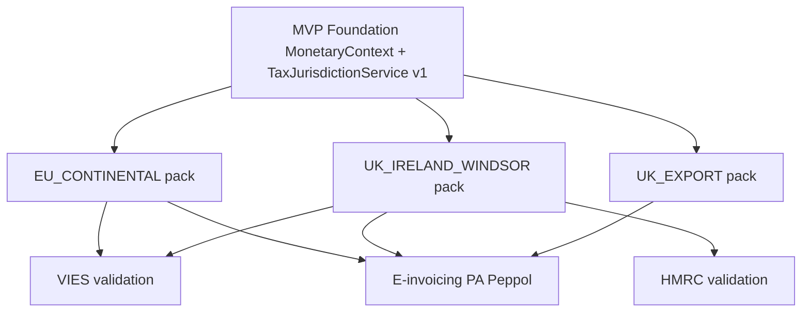

# Phase 1: Corridor Compliance Packs

## Purpose

Define pluggable corridor compliance modules that layer on the **MVP multi-currency foundation** — not separate products. Activated by tenant `corridorPacks` and transaction context.

## Architecture



## Pack: EU_CONTINENTAL (FR ↔ DE)

### Activation

- Tenant `corridorPacks` includes `EU_CONTINENTAL`
- Seller or delivery in FR, DE, or other EU member state

### Tax rules

| Scenario | supplyType | vatTreatment |
|----------|------------|--------------|
| FR seller → DE delivery B2B goods | GOODS | INTRA_EU_B2B_ZERO_RATED |
| FR seller → DE delivery B2B services | SERVICES | INTRA_EU_B2B_REVERSE_CHARGE |
| Domestic FR | GOODS/SERVICES | DOMESTIC_STANDARD |

### Integrations

| Service | When | Action |
|---------|------|--------|
| VIES | Customer save, invoice issue | Validate FR/DE VAT IDs; cache 24h |
| E-invoicing PA | Invoice issue | Peppol BIS 3.0 to DE; Factur-X/PPF for FR reporting |
| PPF Flux 10 | FR entity, cross-border | e-Reporting via accredited PA |

### UI

- Tax badge: "Reverse charge" / "Autoliquidation"
- Locale: `fr-FR`, `de-DE` via tenant default
- No manual tax code picker

## Pack: UK_IRELAND_WINDSOR (NI ↔ ROI)

### Activation

- Tenant `windsorFrameworkEligible: true`
- `corridorPacks` includes `UK_IRELAND_WINDSOR`
- Seller GB-NI or IE with cross-border delivery

### Tax rules

| Scenario | supplyType | vatTreatment |
|----------|------------|--------------|
| NI seller → ROI delivery B2B goods | GOODS | WINDSOR_INTRA_EU_GOODS |
| ROI seller → NI delivery B2B goods | GOODS | WINDSOR_INTRA_EU_GOODS |
| NI/UK services to IE | SERVICES | UK_DOMESTIC / reverse charge per UK rules |
| GB mainland → ROI | GOODS | Use UK_EXPORT pack — not Windsor |

### Integrations

| Service | When | Action |
|---------|------|--------|
| VIES | IE VAT validation | Customer save |
| HMRC | GB/NI VAT + XI prefix | Legal entity setup, customer save |
| E-invoicing PA | Invoice issue | Peppol; ROI Nov 2028 / UK Apr 2029 ready |
| Platform FX | Quote creation | GBP/EUR ECB daily (MVP Tier 0) |

### UI

- XI prefix on NI invoices and legal entity
- Dual currency display when GBP/EUR differ
- Tax badge: "Windsor Framework — intra-EU supply"
- Country selector: GB, GB-NI, IE — never generic "UK" for tax

## Pack: UK_EXPORT (GB ↔ ROI / non-EU)

### Activation

- `corridorPacks` includes `UK_EXPORT`
- GB (not GB-NI) seller to IE or non-EU delivery

### Tax rules

| Scenario | vatTreatment |
|----------|--------------|
| GB → ROI goods | EXPORT_ZERO_RATED |
| GB → non-EU | EXPORT_ZERO_RATED |

## VAT validation service contract

```typescript
interface VatValidationRequest {
  country: string;
  vatNumber: string;
  prefix?: string;
}

interface VatValidationResult {
  valid: boolean;
  validatedAt: string;
  source: "VIES" | "HMRC" | "MANUAL_OVERRIDE";
  registeredName?: string;
}
```

- Non-blocking if external service unavailable — flag for manual review
- Immutable audit log of validation results on customer/invoice

## E-invoicing PA integration contract

Single REST adapter; corridor determines output format:

| Corridor | Output formats |
|----------|----------------|
| EU_CONTINENTAL | Peppol BIS 3.0, Factur-X, XRechnung |
| UK_IRELAND_WINDSOR | Peppol BIS 3.0, EN 16931 |
| UK_EXPORT | Peppol (future UK mandate) |

Recommended vendors: B2Brouter, Storecove, Pagero.

## CS V3 migration

- Import `legacyTaxCode` for audit only
- Cloud resolves `taxJurisdiction` afresh — do not trust legacy tax code mapping for new transactions
- Flag imported records where legacy code conflicts with auto-resolved treatment

## Reference implementation

- [`src/services/tax-jurisdiction-service.ts`](../src/services/tax-jurisdiction-service.ts)

## Related documents

- [MVP admin setup spec](./mvp-admin-setup-spec.md)
- [Billing & Invoicing API extension](./billing-invoicing-api-extension.md)
