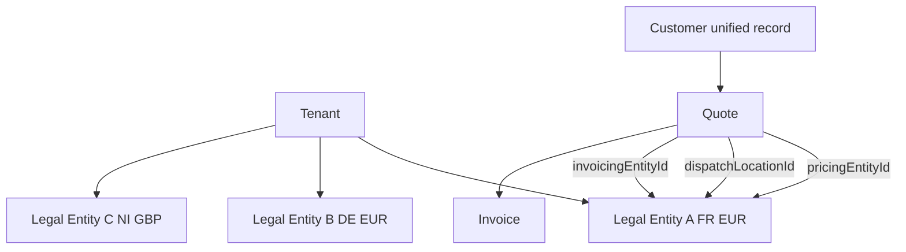

# Phase 2: Multi-Legal-Entity Billing

## Purpose

Support pricing entity, invoicing entity, and dispatch entity separation **without exposing CS V3 code names** in Cloud UI. Aligns with Command Cloud near-term multi-legal-entity invoicing roadmap.

## Problem (CS V3 today)

- Pricing Company Code vs Shipping Company Code vs Company Code create admin confusion at border plants
- Separate AR and GL per entity requires manual company code permutations
- No consolidated customer view across entities under one group

## Cloud model



## Canonical fields (extension to MonetaryContext)

| Field | Description |
|-------|-------------|
| `pricingEntityId` | Entity whose price list applies (default = user's legal entity) |
| `invoicingEntityId` | Entity that issues invoice / AR (default = pricing entity) |
| `dispatchEntityId` | Entity operating dispatch (default = pricing entity) |
| `dispatchLocationId` | Plant/location (unchanged from MVP) |

**UI rule:** Users select **location** and **customer** — entities resolved automatically unless finance override.

## Intercompany scenarios

### Border plant (FR entity prices, FR plant dispatches to DE)

- `pricingEntityId`: FR entity
- `invoicingEntityId`: FR entity
- `dispatchLocationId`: FR border plant
- `taxJurisdiction`: EU_CONTINENTAL intra-EU

### Group with NI + ROI entities under one tenant

- Customer: single unified record
- Quote from NI entity to ROI customer: `pricingEntityId` = NI, `functionalCurrency` = GBP
- Quote from ROI entity to NI customer: `pricingEntityId` = ROI, `functionalCurrency` = EUR
- AR balances segmented by `invoicingEntityId` in consolidated customer view

### Intercompany markup (optional Phase 2b)

When dispatch entity ≠ invoicing entity:

- Internal transfer price between entities
- `intercompanyMarkup` on MonetaryContext (percentage or fixed)
- ERP export includes intercompany journal hints

## Consolidated customer AR view

| Column | Source |
|--------|--------|
| Customer name | Unified customer |
| Entity | `invoicingEntityId` |
| Outstanding | Sum per entity functional currency |
| Preferred currency | Customer preference |

## API extensions

```
GET /api/v1/customers/{customerId}/accounts-receivable?consolidated=true
GET /api/v1/legal-entities
POST /api/v1/quotes — accepts optional pricingEntityId / invoicingEntityId override (finance role)
```

## CS V3 import

| CS V3 | Cloud |
|-------|-------|
| Pricing Company Code | `pricingEntityId` via mapping table |
| Shipping Company Code | `dispatchEntityId` |
| Company Code on invoice | `invoicingEntityId` |

## Dependencies

- Command Cloud multi-legal-entity invoicing roadmap item
- MVP MonetaryContext (Phase 0/MVP foundation)

## Related documents

- [Canonical monetary/tax field spec](./canonical-monetary-tax-field-spec.md)
- [MVP admin setup spec](./mvp-admin-setup-spec.md)
