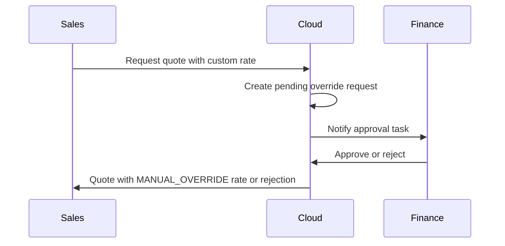

# Phase 3: Advanced FX and Treasury

## Purpose

Extend MVP Platform FX Service for tenants needing more than ECB daily rates — contract-fixed rates, finance approval workflows, additional currency pairs, and ERP revaluation export.

**Not required for MVP launch.** NI/ROI corridor is served by MVP ECB daily rates.

## MVP vs Phase 3 capability matrix

| Capability | MVP (Tier 0) | Phase 3 (Advanced) |
|------------|--------------|-------------------|
| Rate source | ECB daily (GBP/EUR, EUR pairs) | Commercial intraday feeds |
| Currency pairs | Tenant `enabledCurrencies` | CHF, PLN, USD, etc. |
| Rate lock | Quote acceptance | + Contract-fixed independent of market |
| Override | None | Finance approval workflow |
| ERP export | Snapshot metadata | Period-end revaluation batch |
| Presentation currency | Auto from customer/functional | Multi-level display rules |

## Contract-fixed exchange rates

### Customer-level contract

```json
{
  "customerId": "cust-roi-5678",
  "contractFxRate": {
    "baseCurrency": "GBP",
    "quoteCurrency": "EUR",
    "rate": 1.15,
    "validFrom": "2026-01-01",
    "validTo": "2026-12-31",
    "source": "CONTRACT_FIXED"
  }
}
```

Resolution order at quote creation:

1. Customer contract-fixed rate (if valid for date)
2. Tenant default FX source (ECB daily)
3. Finance manual override (if approved)

## Rate override approval workflow



Audit fields:

- `exchangeRateSource: MANUAL_OVERRIDE`
- `overrideRequestedBy`, `overrideApprovedBy`, `overrideReason`

## Additional currency pairs

Integrations (Tier 3):

| Provider | Use case |
|----------|----------|
| Fixer.io / Open Exchange Rates | Intraday commercial rates |
| ECB SDW | Statutory reference |
| ERP feed | Customer already maintains rates in SAP/Sage |

Tenant config extension:

```json
{
  "enabledCurrencies": ["GBP", "EUR", "CHF", "PLN"],
  "fxSources": {
    "primary": "ECB_DAILY",
    "commercial": "FIXER_IO",
    "fallback": "ERP_FEED"
  }
}
```

## ERP revaluation export

Period-end batch for finance:

```
GET /api/v1/fx/revaluation-export?period=2026-06&legalEntityId=ni-legal-entity-004
```

Returns:

- Open AR/AP balances in transaction currency
- Functional currency equivalents at period-end rate
- Unrealised gain/loss entries for ERP import

## Schema extensions

Optional fields on MonetaryContext (Phase 3 only):

| Field | Type |
|-------|------|
| `contractFxRateId` | string |
| `overrideRequestId` | string |
| `revaluationPeriodRate` | number |

## Related documents

- [MVP admin setup spec](./mvp-admin-setup-spec.md)
- [Billing & Invoicing API extension](./billing-invoicing-api-extension.md)
